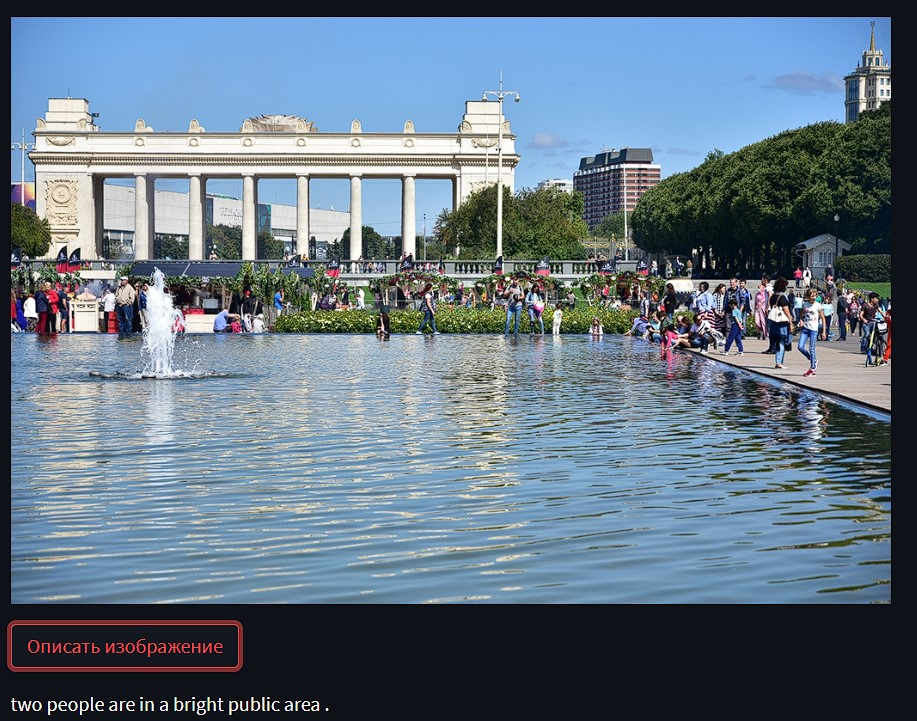
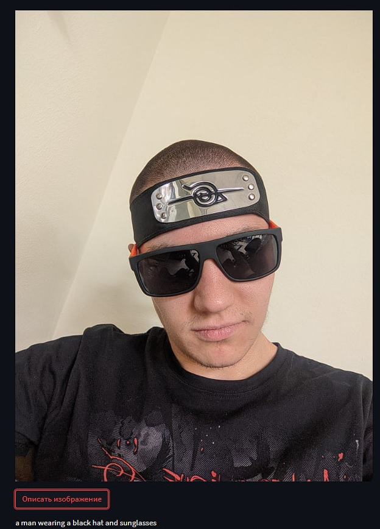

# Image-Captoning-Model
A model for describing what is depicted in the photos

------------------------------------

Image Captioning model - это модель, которая по фотографии выдает её описание.

Делал я это для себя  и целью было ознакомиться и реализовать модель с задачей описания изображения.
Для использования модели я выбрал библиотеку `Stremlit`, так как он прост и эффективен. Так же его можно выгрузить в `StreamlitCloud` бесплатно, что большой плюс.

Чтобы запустить все локально нужно ввести в командную строку или терминал в `PyCharm` команду

`streamlit run web.py`.

Датасет
------------------------------------
В качестве датасета был взят [Flickr 8k](https://www.kaggle.com/datasets/adityajn105/flickr8k/versions/1). Изначально хотелось взять датасет, содержащий описания на русском, но такового не нашлось. 

Можно было взять и [Flickr 30k](https://www.kaggle.com/datasets/hsankesara/flickr-image-dataset), но она показалась слишком большой при маленькой модели. 

Планируется дальше обучить уже другую более большую сеть уже на этом датасете.

Модель
------------------------------------
В качестве модели был взят `Encder` `ResNet-50`, а `Decoder`  обычная рекурентная сеть с `LSTM`. 

В папке `model_weights` лежат веса данной модели, которые подгружаются при инициализации веб-демо.

Результаты
------------------------------------

  
  

Результаты, коненчо, неочень, нужно побольше модель и подольше её пообучать. 

Источники
------------------------------------
Датасет:  
https://github.com/ari-dasci/OD-WeaponDetection  

Streamlit: 
https://streamlit.io/  
https://habr.com/ru/post/664076/  
https://medium.com/nuances-of-programming/как-развернуть-веб-приложение-streamlit-в-сети-три-простых-способа-3fe4bdbbd0a9   

Tutorial for Image Captioning:  
https://github.com/sgrvinod/a-PyTorch-Tutorial-to-Image-Captioning  
